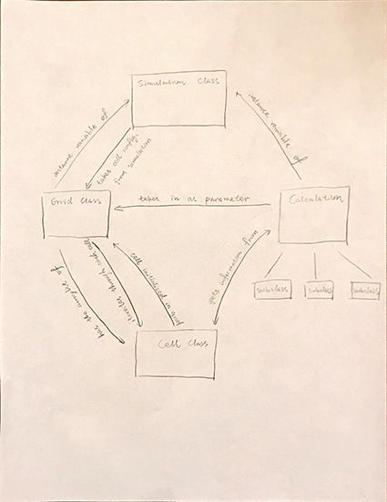
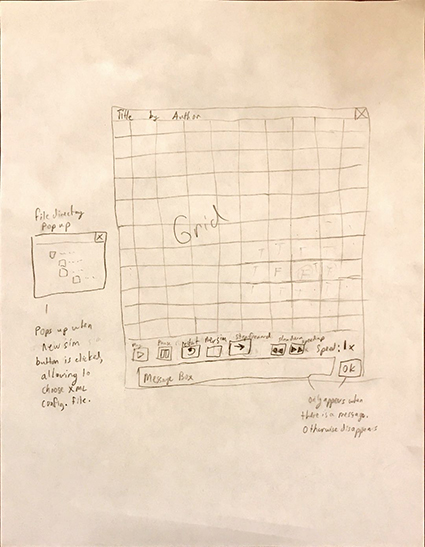

# cellsociety

CompSci 308 Cell Society Project

### Introduction

The target of this project is to construct a model which simulates a grid in which many independent cells interact each other.

The primary design goal of this project is to introduce abstract superclasses open for modification in order to make the project flexible.

The primary architecture of the design:

1.	The method which reads the XML file should be closed. 
	
2.	The simulation and the grid class should be fairly closed.
	
3.	The cell class should be open for modifications.

### Overview

(Abstract) Calculation class:
*	variables:

			random seeds (arbitrary)
			
			time (read from system time)
*	methods:

			calculate the probability based on values from grid class (many duplicates which takes different kind of cells as inputs)
			
*	interactions:

			grid class
			
Cell class:
*	variables:

			current state (decide the color etc. and determined by value)

			future state 

			property[] (an array contains all special property of current simulation)

*	methods:

			constructor of cells
	
			update state 
		
			set future state
	
			return the state
	
			return property
	
*	interactions: 
	
			grid class, simulation class
			
Grid class:
*	variables:

			locations (a 2D array which stores locations of all cells)
			
			dimensions of the grid
			
*	methods:

			create the 2D arraylist of cells 
			
			iterate through each grid (by location)
			
*	interactions:

			cell class, calculation class, simulation class
			
Simulation class:
*	variables:

			rules of simulations (i.e. grids) to choose (contains rules and methods)
			
			key input (read from keyboard and mouse)
			
*	methods:

			reader of XML file
			
			initialize calculation
			
			key input reader
			
			visualization (draw grids and interface)
			
			checker (whether the simulation is finished or erroneous)
			
*	interactions:

			cell class, grid class

### User Interface

*	Before starting the animation, we will have the user navigate through the file directory to choose the XML configuration file. The user will have the ability to start, pause, and restart the simulation. The simulation’s speed can also be changed, or the user can go and step through the animation one frame at a time when it is paused. During the animation, the user will be able to switch the XML file to that of a different simulation, and once selected, it will start the new simulation. The play, pause, restart, step forward, slow down, speed up, and new simulation functionality will all be given by buttons at the bottom, below the grid. The speed will be displayed as a multiplier to the right of the buttons, e.g. 0.5x, 1x, 2x, 3x. Whenever directions are given to the user or an error occurs, an area will appear on the screen that displays the message and will disappear when the user acknowledges it. When there is a message, the simulation will be paused and all of the buttons besides restart and new simulation will be grayed out. When the new simulation button is clicked, a popup will appear with the file directory browser from which you can select your new configuration 

### Design Details 

(Abstract) Calculation Class:

The (abstract) calculation class should be able to communicate with the grid class and the simulation class in different degrees. It should also be able to develop subclasses that hold some common methods and hold some methods unique to themselves, which are derived from the abstract methods in the superclass. For each type of cells, a new calculation method is implemented that takes that specific type of cell as inputs and calculates and returns the probability corresponding to each simulation. The detailed functionalities and implementations are described below. 

1. It contains the method to calculate and return the probability of updating one specific cell's state based on its neighbors. This method in the calculation class takes the states of the adjacent cells as input and calculates the probability with respect to specific rules and parameters in the XML file. It then returns the value of probability to the grid class for updating purposes. 

Cell Class:

The cell class should be able to communicate with the grid class only. The cell class holds only the current and future property of itself. 

1. It contains the method to change the state of the cell. It takes the future state of this cell as input and saves it as the current state of this cell. The goal of this design is to prevent interference between any two iterations. 

2. It contains the method to return the current state of the cell. This method functions to communicate with the grid class to make the calculation of probability possible. 

3. It contains the method to set the future state of the cell. This is calculated based on the calculation method and will replace the current state at the end of each iteration. 

Grid Class:
The grid class facilitates communication between the calculation class and the cell class. It contains 2D arraylist that stores all of the cells. It also has the dimensions of the grid. It communicates with the cell class and the simulation class. 

1. This method creates the arraylist and substantiates them with cells based on the dimensions, which are given from reading the file.
This method iterates through the arraylist and updates the future state of the cells, as for each cell, the cell’s method to change its future state will be called. It takes in a calculation parameter. The calculation subclass it takes in as a parameter will depend on the title of the simulation read in from the xml file. Then it will iterate through the arraylist again, this time calling each cell’s method to update the current state from the future state.

Simulation Class:
The simulation class is the very outside frame of the project. It should be able to read the simulation from an XML file, including the rules and visualization of it. From the information is reads it will decide which calculator to use in the current simulation. 

1. It contains the method to read a XML file. It then uses the data in the XML file to create one instance of the grid class and stores the global configuration parameters for the calculation class. 

2. It contains the method to initialize the calculation subclass instance for one speicifc tyep of simulation. This instance would be used to calculate the probability for this specific simulation that updates the cell state. 

3. It contains the method to access and display the state of each cell in the grid.

4. It contains the method to check whether the simulation is finished or erroneous, and display the UI correspondingly. 

5. It contains the method to check the UI input. This functions to check whether the user presses a button/key to initialize certain interactions (e.g., changing the simulation, pausing the simulation, etc.)

Use Case 1:

The calculation class’s calculateProb method will return 0 (0 for dead, 1 for alive). This will be a parameter in the cell’s change state method, which will update the cell’s future state instance variable to dead. The calculate probability method takes in as parameters the state of the current cell and the four adjacent cells. There are two ways that a live cell can die.
Any live cell with fewer than two live neighbors dies, as if caused by underpopulation.
Any live cell with more than three live neighbors dies, as if by overpopulation.
So if the middle cell is alive (current state = 1), and the sum of the states of adjacent cells equals 0, 1, or 4, then calculate probability method will return 0, and the future state will be set to 0.

Use Case 2:

State of a cell : 0 for live, 1 for dead
Iterate all cells in the grid, first check whether the surrounding cells of a central exists. If all adjacent cells exist, skip the current central cell. 
The calculations class’s calculateProb method will return 0 or 1, based on the following rules:
1.Any live cell with two or three live neighbors lives on to the next generation.
2.Any dead cell with exactly three live neighbors becomes a live cell, as if by reproduction.

Use Case 3:

In the simulation class, one method calls the grid instance and the iteration method in the grid class instance. At the end of the iteration method in the grid class, all the current states of the cells will be updated to the future states of the cells. After the iteration method ends, all the cells will be updated to their new states. Then, the visualization method draws the grid and displays the result graphically. 

Use Case 4:

Read the XML file in, set a number for the probCatch. The probCatch will be included as a parameter of the constructor for a calculator subclass, specific to that instance of the fire simulation. Different simulations use different calculator subclasses.

Use Case 5:

Have method that checks mouse input. This will check to see if the mouse was clicked while on the “new simulation” button. If it is clicked, a FileChooser class will be instantiated, and the path of the file chosen will be given as an argument into the readFile method. Then the ArrayList of cells in the grid will be created again through the grid’s method, and then the cells will be drawn according to the information in the arraylist. Then, our we instantiate an instance of a different calculation subclass. 

### Design Considerations

Whether to have a cell abstract class and multiple cell subclasses or to have a calculation abstract class and multiple calculation subclasses with one cell class. We chose to have multiple calculation classes.

Pros: The cell doesn’t do any calculation and only worries about itself. We have more classes to divide the work.

Cons: Harder to implement. 

Should we put the iterator of every cell into grid class or simulation class.

We choose to put it into the grid class.

Pros: The grid class contains the arraylist of cells as a variable so it is easier and faster for it to access each cell than simulation class, meanwhile it is easier to implement.

### Team Responsibilities

Simulation class: 

			everyone

Grid class: 

			Primary: Frank
	
			Secondary: Jing
			
Calculation class (and subclasses):

			Primary:Eric
			
			Secondary: Frank
			
Cell class:

			Primary: Jing
			
			Secondary: Eric
